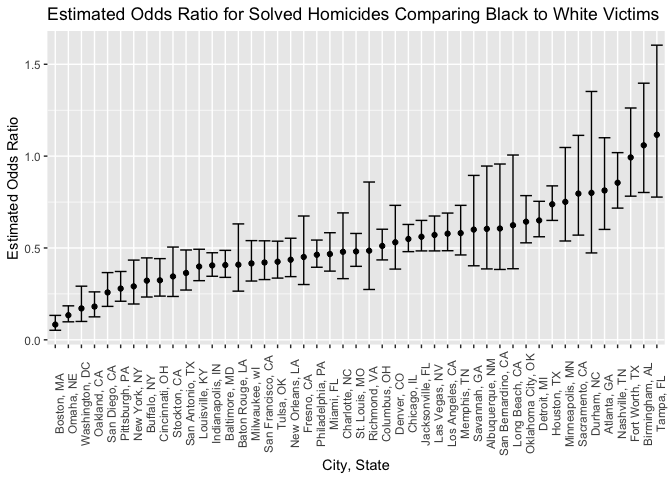
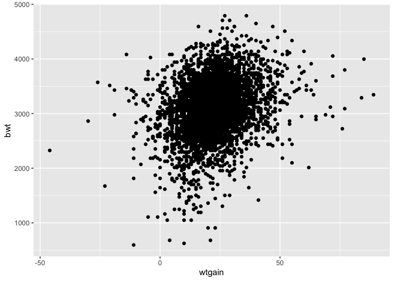
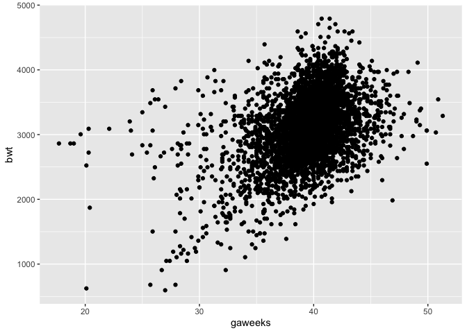
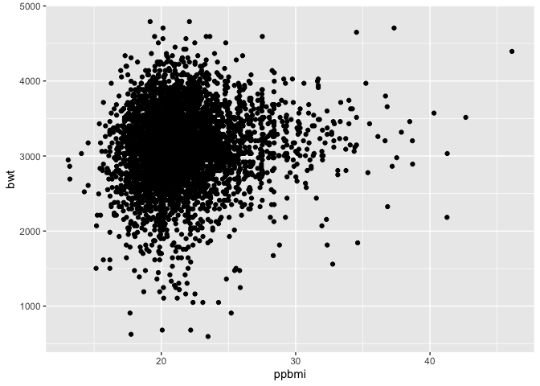
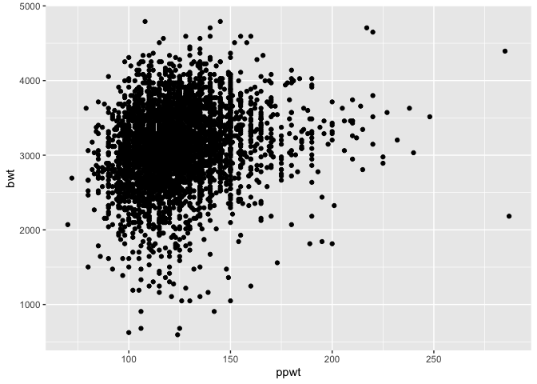
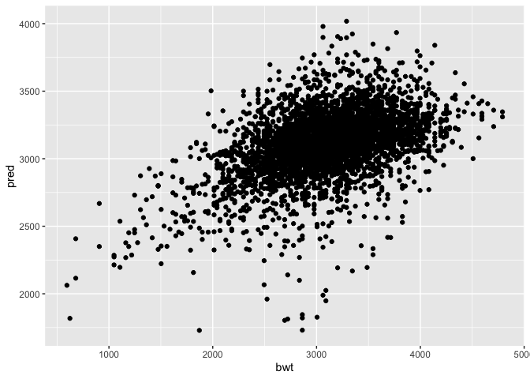
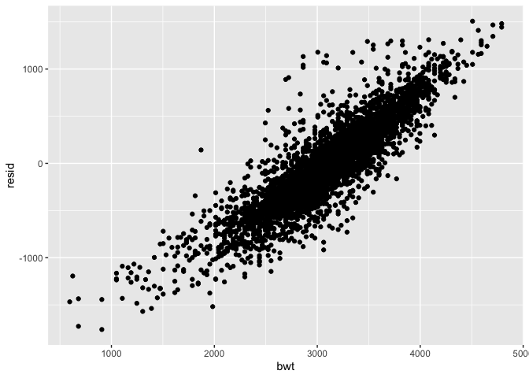
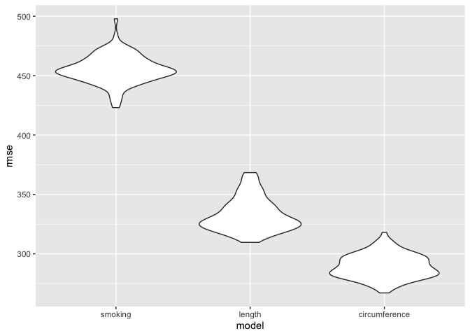

p8105\_hw6\_jp3665
================
Joana Petrescu
12/8/2020

``` r
library(tidyverse)
## install.packages("janitor")
library(janitor)
## install.packages("modelr")
library(modelr)
```

## Washington Post homicide data

This data gathered by the Washington Post contains information about the
victim, location, and disposition of over 52,000 homicides that occurred
over the past decade in 50 of the largest cities in the U.S.

Import crime data, create a `city_state` variable, filter out cities
that do not report victim race, add logical column `solved` representing
whether the case has been solved (Closed with arrest or Closed without
arrest), filter to include only crimes with victims that were `White` or
`Black`.

``` r
homicide_data <- read.csv("https://raw.githubusercontent.com/washingtonpost/data-homicides/master/homicide-data.csv")

homicide_data <- homicide_data %>%
  mutate(.keep = "all", city_state = paste(city, state, sep = ", ")) %>%
  filter(city_state != c("Phoenix, AZ", "Dallas, TX", "Kansas City, MO", "Tulsa, AL")) %>%
  mutate(solved = as.numeric(disposition != c("Open/No arrest"))) %>%
  mutate(victim_age = as.numeric(victim_age)) %>%
  filter(victim_race %in% c("White", "Black")) %>%
  select(city_state, solved, victim_age, victim_race, victim_sex)


head(homicide_data)
```

    ##        city_state solved victim_age victim_race victim_sex
    ## 1 Albuquerque, NM      1         15       White     Female
    ## 2 Albuquerque, NM      1         72       White     Female
    ## 3 Albuquerque, NM      0         91       White     Female
    ## 4 Albuquerque, NM      0         56       White       Male
    ## 5 Albuquerque, NM      1         NA       White       Male
    ## 6 Albuquerque, NM      1         43       White     Female

### Generalized linear model for solving homicides by race

Using Baltimore, MD as an example, use a generalized linear model to
calculate odds ratio and confidence intervals for solving homicides
comparing non-white victims to white victims, keeping age and sex fixed.

``` r
baltimore_glm <- homicide_data %>%
  filter(city_state == "Baltimore, MD") %>%
  mutate(victim_race = factor(victim_race, levels = c("White", "Black"))) %>%
  glm(solved ~ victim_age + victim_race + victim_sex, data = ., family = binomial()) %>%
  broom::tidy() %>%
  mutate(OR = exp(estimate), OR_min = exp(estimate - std.error), OR_max = exp(estimate + std.error)) %>%
  mutate(across(is.numeric, ~ round(., 3))) %>%
  mutate(CI = (paste(OR_min, OR_max, sep = "-"))) %>%
  select(term, OR, CI)

baltimore_glm %>% filter(term == "victim_raceBlack") %>% knitr::kable()
```

| term              |    OR | CI         |
| :---------------- | ----: | :--------- |
| victim\_raceBlack | 0.407 | 0.34-0.487 |

Iterate across all cities to calculate odds ratio and confidence
intervals for solving homicides comparing non-white victims to white
victims, keeping age and sex fixed.

``` r
homicide_data <- homicide_data %>%
  mutate(victim_race = factor(victim_race, levels = c("White", "Black")))

homicide_nest <- homicide_data %>%
  nest(data = -city_state) %>%
  filter(city_state != "Tulsa, AL")

homicide_glm <- homicide_nest %>%
  mutate(
    results = map(data, ~glm(solved ~ victim_age + victim_race + victim_sex, data = .x, family = binomial()) %>%
                    broom::tidy())
  ) %>%
  select(-data) %>%
  unnest(results) %>%
  mutate(OR = exp(estimate), OR_min = exp(estimate - std.error), OR_max = exp(estimate + std.error)) %>%
  mutate(across(is.numeric, ~ round(., 3))) %>%
  mutate(CI = (paste(OR_min, OR_max, sep = "-"))) %>%
  filter(term == "victim_raceBlack") 

homicide_glm %>%  select(city_state, OR, CI) %>% knitr::kable()
```

| city\_state        |    OR | CI          |
| :----------------- | ----: | :---------- |
| Albuquerque, NM    | 0.604 | 0.386-0.946 |
| Atlanta, GA        | 0.813 | 0.601-1.1   |
| Baltimore, MD      | 0.407 | 0.34-0.487  |
| Baton Rouge, LA    | 0.409 | 0.265-0.631 |
| Birmingham, AL     | 1.059 | 0.802-1.397 |
| Boston, MA         | 0.083 | 0.052-0.133 |
| Buffalo, NY        | 0.322 | 0.233-0.446 |
| Charlotte, NC      | 0.479 | 0.333-0.691 |
| Chicago, IL        | 0.549 | 0.48-0.628  |
| Cincinnati, OH     | 0.324 | 0.238-0.442 |
| Columbus, OH       | 0.511 | 0.435-0.602 |
| Denver, CO         | 0.531 | 0.385-0.732 |
| Detroit, MI        | 0.650 | 0.561-0.754 |
| Durham, NC         | 0.800 | 0.473-1.352 |
| Fort Worth, TX     | 0.993 | 0.782-1.262 |
| Fresno, CA         | 0.451 | 0.301-0.674 |
| Houston, TX        | 0.738 | 0.65-0.838  |
| Indianapolis, IN   | 0.405 | 0.346-0.474 |
| Jacksonville, FL   | 0.561 | 0.484-0.65  |
| Las Vegas, NV      | 0.571 | 0.484-0.674 |
| Long Beach, CA     | 0.624 | 0.387-1.006 |
| Los Angeles, CA    | 0.578 | 0.485-0.69  |
| Louisville, KY     | 0.399 | 0.322-0.493 |
| Memphis, TN        | 0.581 | 0.462-0.732 |
| Miami, FL          | 0.467 | 0.374-0.583 |
| Milwaukee, wI      | 0.416 | 0.32-0.54   |
| Minneapolis, MN    | 0.751 | 0.538-1.047 |
| Nashville, TN      | 0.855 | 0.717-1.019 |
| New Orleans, LA    | 0.436 | 0.344-0.553 |
| New York, NY       | 0.291 | 0.195-0.434 |
| Oakland, CA        | 0.181 | 0.125-0.261 |
| Oklahoma City, OK  | 0.643 | 0.528-0.785 |
| Omaha, NE          | 0.134 | 0.098-0.185 |
| Philadelphia, PA   | 0.463 | 0.395-0.543 |
| Pittsburgh, PA     | 0.279 | 0.21-0.372  |
| Richmond, VA       | 0.485 | 0.274-0.859 |
| San Antonio, TX    | 0.364 | 0.271-0.489 |
| Sacramento, CA     | 0.796 | 0.57-1.113  |
| Savannah, GA       | 0.600 | 0.403-0.895 |
| San Bernardino, CA | 0.606 | 0.383-0.957 |
| San Diego, CA      | 0.258 | 0.182-0.366 |
| San Francisco, CA  | 0.421 | 0.328-0.539 |
| St. Louis, MO      | 0.481 | 0.4-0.579   |
| Stockton, CA       | 0.345 | 0.236-0.505 |
| Tampa, FL          | 1.116 | 0.777-1.604 |
| Tulsa, OK          | 0.425 | 0.336-0.537 |
| Washington, DC     | 0.171 | 0.1-0.292   |

Plot estimated odds ratios and confidence intervals for solving
homicides comparing non-white victims to white victims, keeping age and
sex fixed.

``` r
homicide_glm %>% 
  mutate(city_state = fct_reorder(city_state, OR)) %>%
  ggplot(aes(x = city_state, y = OR)) +
  geom_errorbar(aes(ymin = OR_min, ymax = OR_max)) +
  geom_point() +
  theme(axis.text.x = element_text(angle = 90)) +
  xlab("City, State") +
  ylab("Estimated Odds Ratio") +
  labs(title = "Estimated Odds Ratio for Solved Homicides Comparing Black to White Victims")
```

<!-- -->

## Factors affecting children’s birthweight

Load birthweight data and recode variables

``` r
birthweight_data <- read.csv("./data/birthweight.csv") %>% 
  clean_names() %>%
  mutate(babysex = recode(babysex, "1" = "male", "2" = "female")) %>%
  mutate(frace = recode(frace, "1" = "White", "2" = "Black", "3" = "Asian", "4" = "Puerto Rican", "8" = "Other", "9" = "Unknown")) %>%
  mutate(malform = recode(malform, "0" = "absent", "1" = "present")) %>%
  mutate(mrace = recode(mrace, "1" = "White", "2" = "Black", "3" = "Asian", "4" = "Puerto Rican", "8" = "Other"))
```

### Linear model for factors affecting children’s birthweight

Exploring correlations of mother’s weight gain, gestational age,
pre-pregnancy BMI, and pre-pregnancy weight with birth weight. Mother’s
weight gain and gestational age seem to be positively correlated with
birth weight in this dataset whereas there seems to be no association
between pre-pregnancy BMI or pre-pregnancy weight with birth wight.

``` r
birthweight_data %>% ggplot(aes(x = wtgain, y = bwt)) +
  geom_point()
```

<!-- -->

``` r
birthweight_data %>% ggplot(aes(x = gaweeks, y = bwt)) +
  geom_point()
```

<!-- -->

``` r
birthweight_data %>% ggplot(aes(x = ppbmi, y = bwt)) +
  geom_point()
```

<!-- -->

``` r
birthweight_data %>% ggplot(aes(x = ppwt, y = bwt)) +
  geom_point()
```

<!-- -->

In addition to the positive correlations identified above, I know that
research has shown that smoking during pregnancy is associated with
decreased birth weight. Therefore, my proposed linear model for this
birth weight data uses gestational age, mother’s weight gain during
pregnancy, and average number of cigarettes smoked per day during
pregnancy. The second and third linear models are what I will compare my
proposed model to.

``` r
smoking_fit <- lm(bwt ~ gaweeks + smoken + wtgain, data = birthweight_data) 

length_fit <- lm(bwt ~ blength + gaweeks, data = birthweight_data)

circumference_fit <- lm(bwt ~ (bhead + blength + babysex)^2, data = birthweight_data)
```

Plot model birth weight predictions and residuals against birth weight.

``` r
smoking_fit %>% broom::tidy() %>% select(term, estimate, p.value) %>% knitr::kable(digits = 200)
```

| term        |   estimate |       p.value |
| :---------- | ---------: | ------------: |
| (Intercept) | 464.835336 |  7.922088e-08 |
| gaweeks     |  62.848199 | 3.334345e-163 |
| smoken      | \-6.558218 |  2.194449e-12 |
| wtgain      |   9.006826 |  2.043564e-44 |

``` r
birthweight_data <- birthweight_data %>% modelr::add_predictions(smoking_fit) %>% modelr::add_residuals(smoking_fit)

birthweight_data %>% ggplot(aes(x = bwt, y = pred)) +
  geom_point()
```

<!-- -->

``` r
birthweight_data %>% ggplot(aes(x = bwt, y = resid)) +
  geom_point()
```

<!-- -->
These plots demonstrate that my proposed model is insufficient to
explain variance in birth weight. The residuals for my model are close
to zero when the birth weight is \~3000g but gets up to 1000-2000g when
birth weight is low (\<2500g) or high (\>3500 g). This means that my
model can predict birth weights ranging from 2500-3500g relatively
accurately but cannot do so outside of this range.

## Crossvalidation of candidate linear models

``` r
cv_df <- crossv_mc(birthweight_data, 100)

cv_df <- cv_df %>%
  mutate(
    smoking_mod = map(train, ~lm(bwt ~ gaweeks + smoken + wtgain, data = .x)),
    length_mod = map(train, ~lm(bwt ~ blength + gaweeks, data = .x)),
    circumference_mod = map(train, ~lm(bwt ~ (bhead + blength + babysex)^2, data = .x))
  ) %>%
  mutate(
    rmse_smoking = map2_dbl(smoking_mod, test, ~rmse(model = .x, data =.y)),
    rmse_length = map2_dbl(length_mod, test, ~rmse(model = .x, data = .y)),
    rmse_circumference = map2_dbl(circumference_mod, test, ~rmse(model = .x, data = .y))
  )

cv_df %>% 
  select(starts_with("rmse")) %>% 
  pivot_longer(
    everything(),
    names_to = "model", 
    values_to = "rmse",
    names_prefix = "rmse_") %>% 
  mutate(model = fct_inorder(model)) %>% 
  ggplot(aes(x = model, y = rmse)) + geom_violin()
```

<!-- -->
Based on these calculated RMSE values, the model using head
circumference, length, sex, and all interactions between these variables
is the most accurate representation of this birth weight data, while the
linear model that I proposed which only takes into account gestational
gestational age, mother’s weight gain during pregnancy and average
number of cigarettes smoked per day during pregnancy performed the
worst.

##
